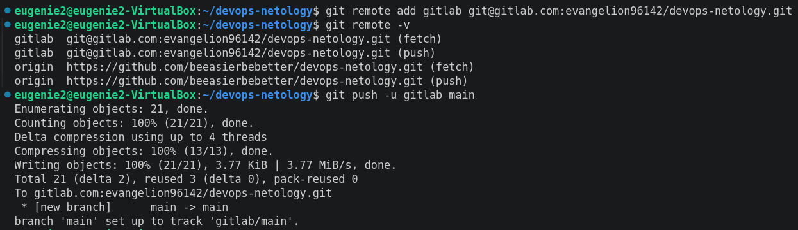
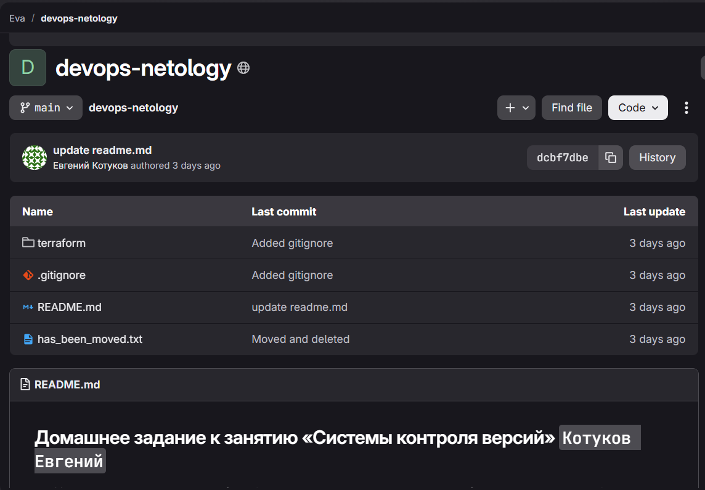
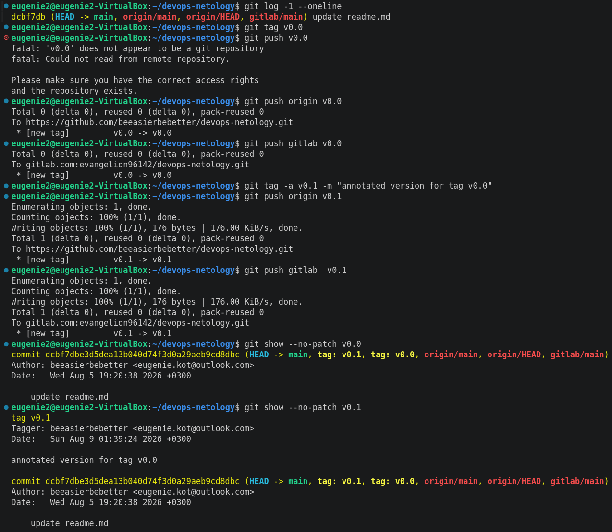
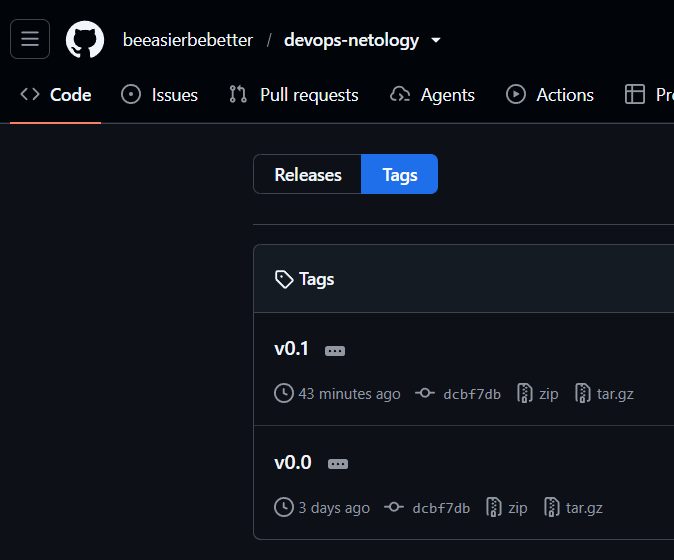
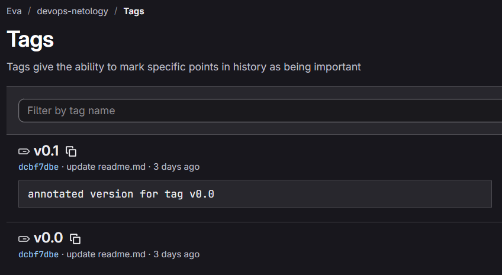
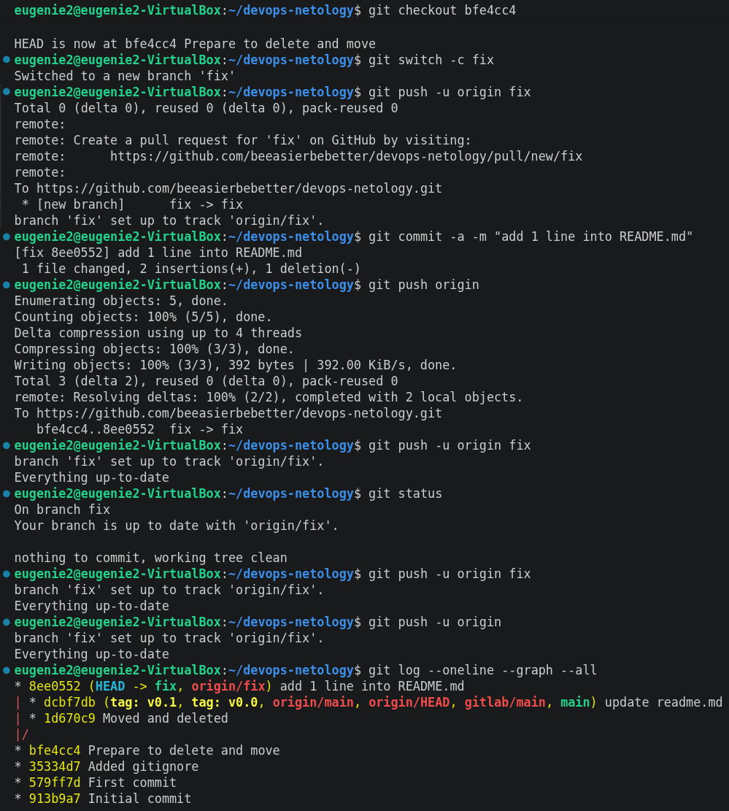
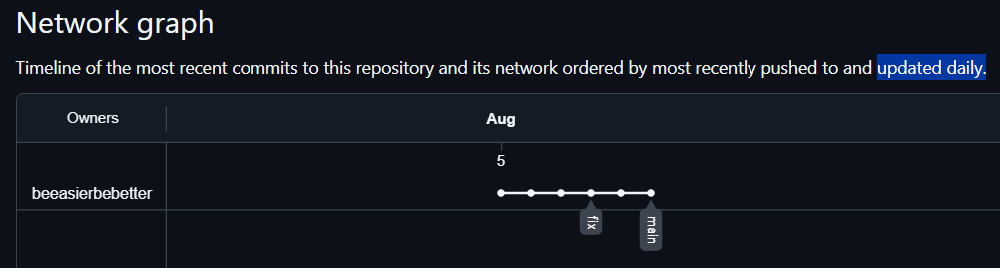
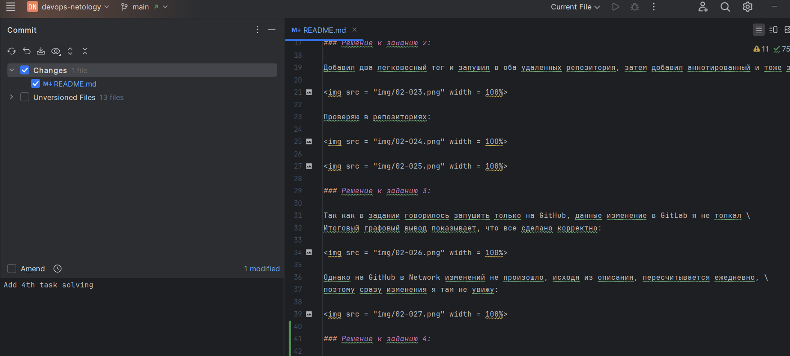
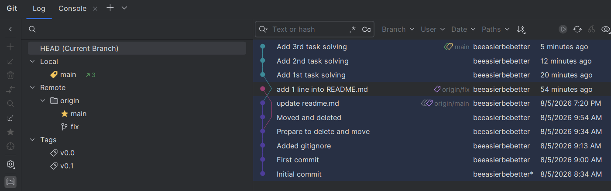

# Домашнее задание к занятию «Основы Git» `Котуков Евгений`

### Решение к заданию 1:

Не без трудностей создал аккаунт в GitLab \
(сейчас требует подтверждать регистрацию иностранной картой и номером телефона) \
Затем создал публичный проект: https://gitlab.com/evangelion96142/devops-netology

Далее добавил его как дополнительный удаленный репозиторий к проекту из прошлого задания:

И проверяю, что в GitLab реально заехал мой проект:

### Решение к заданию 2:

Добавил два легковесный тег и запушил в оба удаленных репозитория, затем добавил аннотированный и тоже запушил:

Проверяю в репозиториях:

### Решение к заданию 3:

Так как в задании говорилось запушить только на GitHub, данные изменение в GitLab я не толкал \
Итоговый графовый вывод показывает, что все сделано корректно:

Однако на GitHub в Network изменений не произошло, исходя из описания, пересчитывается ежедневно, \
поэтому сразу изменения я там не увижу:

### Решение к заданию 4:

Делаю изменения в README.md, и они сразу появляются в Changes. Просто выделяю нужные для коммита файлы, \
затем ниже в поле для комментария ввожу новый коммент:

После того, как я нажму коммит, в этом списке появится еще один:

Думаю, с интерфейсом этой IDE я справился

# Домашнее задание к занятию «Ветвления в Git»

### Решение:

Как я писал в задании выше, Network в GitHub обновляется раз в день, но ссылку все равно прикладываю: \
https://github.com/beeasierbebetter/devops-netology/network \
Но убедиться в выполнении мной задания можно по истории коммитов
