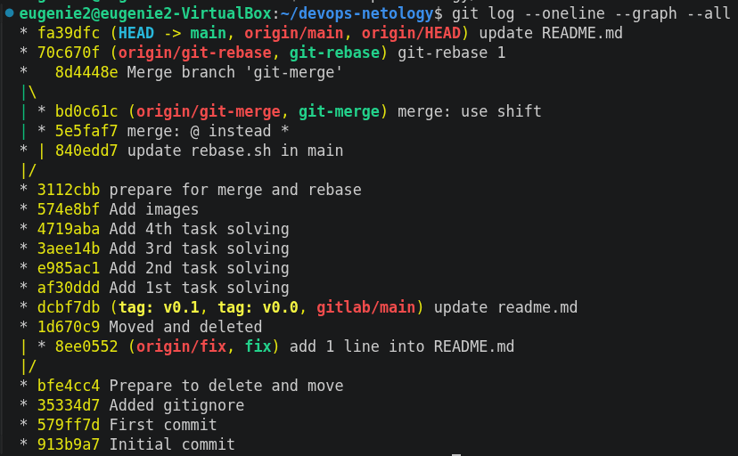

# Домашнее задание к занятию «Основы Git» `Котуков Евгений`

### Решение к заданию 1:

Не без трудностей создал аккаунт в GitLab \
(сейчас требует подтверждать регистрацию иностранной картой и номером телефона) \
Затем создал публичный проект: https://gitlab.com/evangelion96142/devops-netology

Далее добавил его как дополнительный удаленный репозиторий к проекту из прошлого задания:


И проверяю, что в GitLab реально заехал мой проект:


### Решение к заданию 2:

Добавил два легковесный тег и запушил в оба удаленных репозитория, затем добавил аннотированный и тоже запушил:


Проверяю в репозиториях:


### Решение к заданию 3:

Так как в задании говорилось запушить только на GitHub, данные изменение в GitLab я не толкал \
Итоговый графовый вывод показывает, что все сделано корректно:


Однако на GitHub в Network изменений не произошло, исходя из описания, пересчитывается ежедневно, \
поэтому сразу изменения я там не увижу:


### Решение к заданию 4:

Делаю изменения в README.md, и они сразу появляются в Changes. Просто выделяю нужные для коммита файлы, \
затем ниже в поле для комментария ввожу новый коммент:


После того, как я нажму коммит, в этом списке появится еще один:


Думаю, с интерфейсом этой IDE я справился

# Домашнее задание к занятию «Ветвления в Git»

### Решение:

Как я писал в задании выше, Network в GitHub обновляется раз в день, но ссылку все равно прикладываю: \
https://github.com/beeasierbebetter/devops-netology/network \
Но убедиться в выполнении мной задания можно по истории коммитов



# Домашнее задание к занятию «Инструменты Git»

### Решение:

- Полный хэш коммита: aefead2207ef7e2aa5dc81a34aedf0cad4c32545, проверял командой: `git show --no-patch aefea`
- хэш коммита 85024d3 соответствует тегу v0.12.23, проверял командой `git show --no-patch --decorate 85024d3`
- у коммита b8d720 два родителя, т.к. это merge коммит: 56cd7859e0 и 9ea88f22fc, проверял обычным `git show --no-patch b8d720`
- Далее все хеши и комментарии коммитов между двумя тегами проверял командой `git log --pretty=format:'%h %s' v0.12.23..v0.12.24`:
```
33ff1c03bb v0.12.24
b14b74c493 [Website] vmc provider links
3f235065b9 Update CHANGELOG.md
6ae64e247b registry: Fix panic when server is unreachable
5c619ca1ba website: Remove links to the getting started guide's old location
06275647e2 Update CHANGELOG.md
d5f9411f51 command: Fix bug when using terraform login on Windows
4b6d06cc5d Update CHANGELOG.md
dd01a35078 Update CHANGELOG.md
225466bc3e Cleanup after v0.12.23 release
```

- Сначала пробовал через `git grep -p "providerSource("`, но он выдавал именно файл, \
в котором есть данная функция, по итогу сделал через `git log --all -S"providerSource(" --oneline` и получил коммит: 8c928e8358 \
Будь коммитов несколько, то найти самый первый, где появилась функция, можно было добавлением флага --reverse

- Для поиска выполнил сначала выполнил: `git log --all --reverse -S"globalPluginDirs" --oneline --name-only` \
и в результате получил вывод:

```
8364383c35 Push plugin discovery down into command package
commands.go
plugins.go
c0b1761096 prevent log output during init
config_unix.go
35a058fb3d main: configure credentials from the CLI config file
commands.go
7c7e5d8f0a Don't show data while input if sensitive
terraform
fcdb5d2e55 (origin/f-plugin-finder) WIP centralized plugin finder
plugins.go
22c121df86 Bump compatibility version to 1.3.0 for terraform core release (#30988)
terraform
b872613d25 Backport of Bump compatibility version to 1.3.0 for terraform core release into v1.2 (#30990)
terraform
e8eec68de3 backport of commit 1ee5d23894a0c9448d6787e0385dbba356db8096 (#30989)
terraform
125eb51dc4 Remove accidentally-committed binary
terraform
e8a9debd2b Remove accidentally-committed binary
terraform
aa3a155106 Remove accidentally-committed binary
terraform
65c4ba7363 Remove terraform binary
terraform
de49677ecd Run tf exec e2e tests
terraform 2
7c4aeac5f3 stacks: load credentials from config file on startup (#35952)
commands.go
internal/command/cliconfig/plugins.go
```

Далее смотрю в самом старом коммите из списка, в каком файле находится функция: \
`git grep -n "globalPluginDirs" 8364383c35` \
\
И получаю вывод: \
`8364383c35:plugins.go:16:func globalPluginDirs() []string {` \
\
Далее смотрю вывод самого свежего коммита, есть ли там данная функция: \
`eugenie2@eugenie2-VirtualBox:~/terraform$ git grep -n "globalPluginDirs" 7c4aeac5f3` \
\
И получаю пустой вывод. \
После чего проверяю коммит перед ним: \
`eugenie2@eugenie2-VirtualBox:~/terraform$ git grep -n "globalPluginDirs" de49677ecd` \
И снова вижу функцию: \
`de49677ecd:plugins.go:18:func globalPluginDirs() []string {` \
\
От этого коммита выполняю поиск: \
`git log --no-patch -L :globalPluginDirs:plugins.go de49677ecd --oneline` \
И получаю конечный список для ответа:

```
78b1220558 Remove config.go and update things using its aliases
52dbf94834 keep .terraform.d/plugins for discovery
41ab0aef7a Add missing OS_ARCH dir to global plugin paths
66ebff90cd move some more plugin search path logic to command
8364383c35 Push plugin discovery down into command package
```

- Сначала нахожу самый первый коммит, где данная функция создавалась: \
`git log --all --reverse -S"synchronizedWriters" --oneline` \
Получаю: \
```
5ac311e2a9 main: synchronize writes to VT100-faker on Windows
fd4f7eb0b9 remove prefixed io
bdfea50cc8 remove unused
```

Убеждаюсь просмотром изменений самого раннего коммита: \
`git show 5ac311e2a9` \
И убедившись, что в нем появилась искомая функция, беру из вывода автора коммита: `Martin Atkins <mart@degeneration.co.uk>`